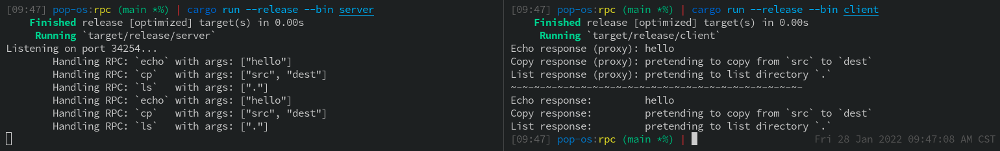

# Overview

Toy example of an RPC client/server system over UDP to solidify concepts from my distributed systems class this morning!

I wanted to play with two different API styles:
- using a `Proxy` interface that manages the socket behind the scenes
- passing the target address explicitly as a function argument

In either case, calling code doesn't need to know what a socket is, only where to find the server.

# Usage

- In one terminal, run:
    - `cargo run --release --bin server`
- In another, run:
    - `cargo run --release --bin client`

The client (in `client/src/main.rs`) calls the server's `echo`, `copy`, and `list` procedures over UDP, first using the `Proxy` API and then passing the server address as an argument.

You should see output similar to this:

